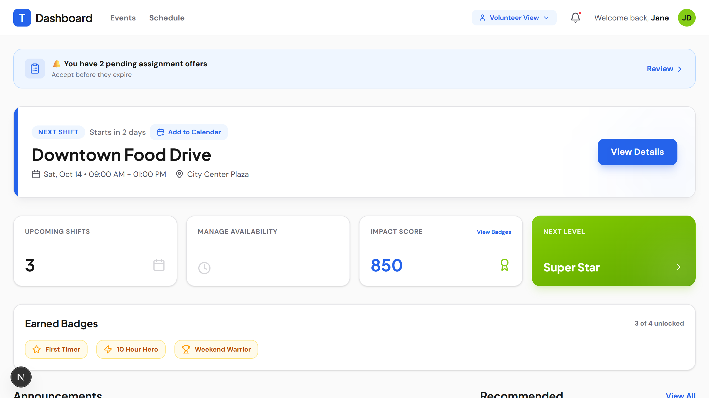
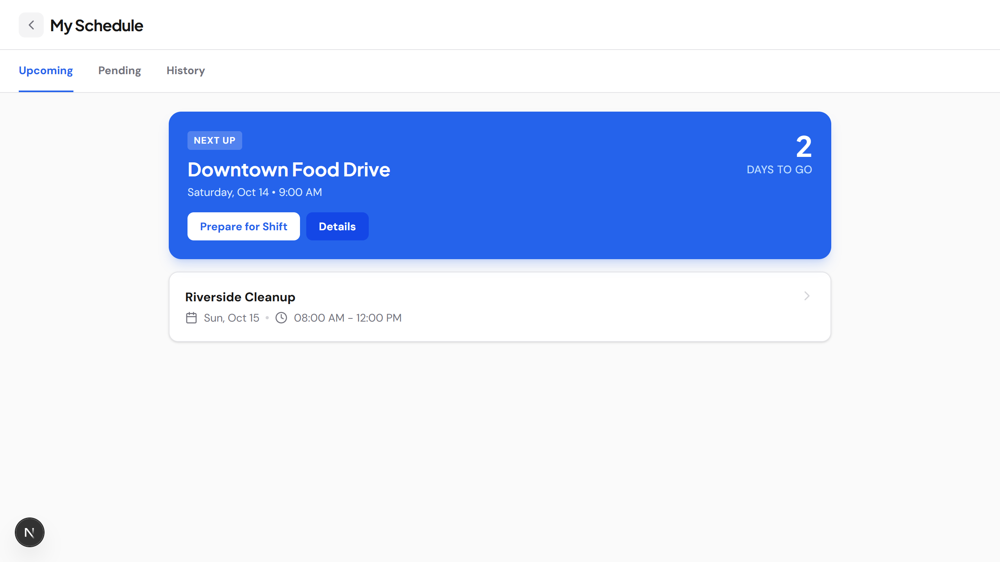
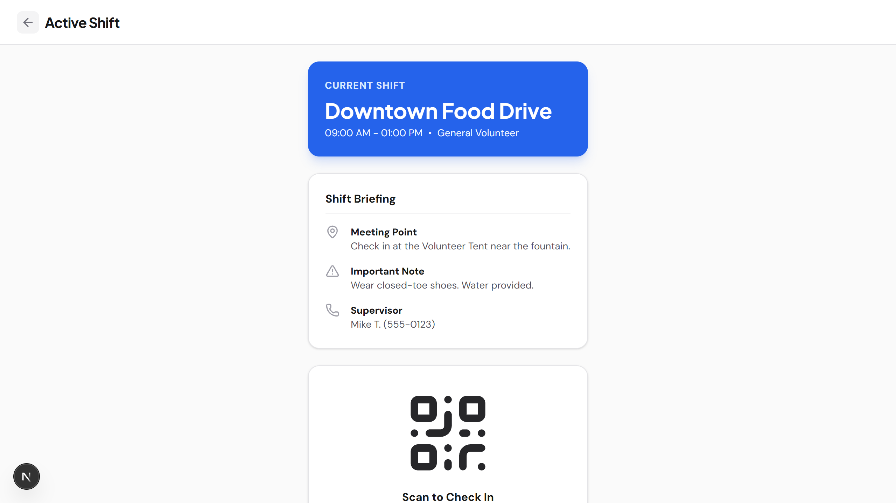
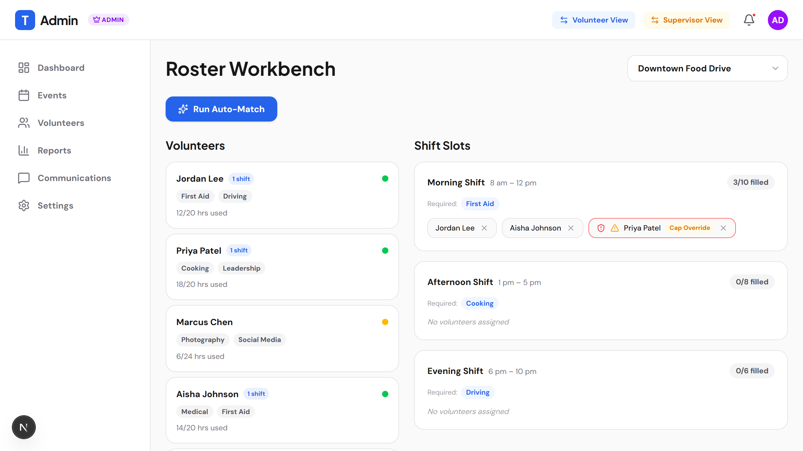
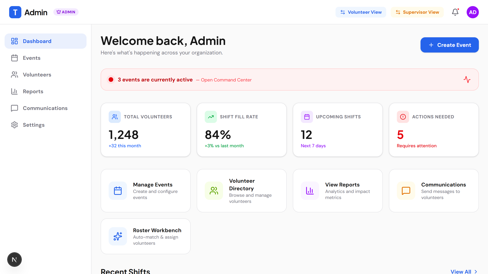

<!-- _class: bg-primary lead -->
# Tribute
## Next-Generation Volunteer Operations

Centralized, Real-Time Ecosystem for Shift Planning and Attendance

---

## The Problem: Fragmented Coordination

Many organizations struggle with:
- **Disjointed systems** for scheduling and tracking.
- **Manual assignment** of skills to shifts.
- **Lack of real-time visibility** into volunteer attendance.
- **Complex communication** during active events.

---

## The Solution: A Unified Platform

Tribute brings everything together:
- Centralized scheduling and roster management.
- Real-time active shift tracking.
- Smart auto-matching based on skills.
- Role-based access for Admins, Supervisors, and Volunteers.

---

## Platform Overview: Dashboard

Volunteers get a clear view of their upcoming shifts, hours logged, and quick actions.

---

## Shift Planning & Discovery

Easily browse, filter, and sign up for available shifts based on skills and availability.

---

## Active Shift Tracking

Real-time tracking for volunteers actively working, with check-in/out and incident reporting.

---

## AI Shift Matching

Admins can leverage AI-powered **Auto-Match** to instantly assign the right volunteers to the right roles based on required skills.

---

## Platform Administration

Comprehensive tools for creating events, managing waitlists, and viewing platform analytics.

---

## Technology Stack

Built for performance, scalability, and seamless user experience:

- **Next.js 16 (App Router)** for rapid, SEO-friendly rendering.
- **Progressive Web App (PWA)** capabilities for offline access and installability.
- **Tailwind CSS** for modern, responsive, and accessible styling.
- **TypeScript** for robust, type-safe development.

---

<!-- _class: bg-primary lead -->
# Join the Revolution in Volunteer Management

[tribute-platform.com](#)
